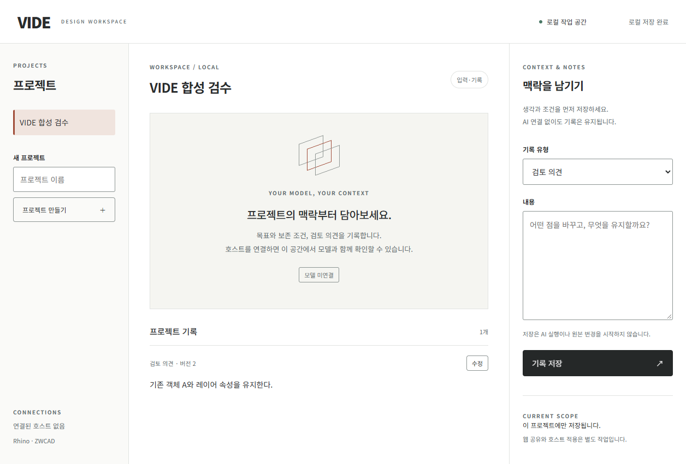

# 로컬 프로젝트·입력 화면 검증

## 범위·실행

`npm.cmd start`로 로컬 작업 공간을 실행한다. 기본 데이터 위치는 사용자 LocalAppData의 VIDE이며 시험에서는 `VIDE_DATA_DIR=.vide/ui-check`를 지정했다. 시작 링크로 세션을 교환한 뒤 주소에서 인증 fragment가 제거된다. 사용한 검증 도구는 agent-browser 0.38.1이다.

## 실제 결과

1256px 너비의 브라우저에서 화면·주요 조작 요소가 표시됐고 오류 목록은 비어 있었다. 합성 프로젝트 생성 → 검토 의견 저장 → 루트 페이지 재열기 → 저장된 의견 복원 → 수정 → 버전 2와 수정 본문 표시를 확인했다. 저장 시 AI나 호스트 호출은 발생하지 않는다. 화면은 미연결 모델 상태를 표시한다.

서버 계약 테스트 4개를 포함한 `npm.cmd test` 전체 24개가 통과했다. 쿠키 없는 요청, 다른 Origin, 다른 Host, cross-site 요청, Origin 없는 쓰기를 거절했다. 한국어 UTF-8 바이트가 HTTP 청크 사이에 나뉜 저장도 확인했다. 이 검사는 AC-30의 일부 경계 확인이며 외부 웹 권한 검수는 아니다.

## 한계

객체 핀·스케치·모델 뷰어·AI 대화·실제 호스트 연결은 이 화면에 아직 연결되지 않았다. 저장하지 않은 작성 내용은 현재 페이지에서 프로젝트 전환 시 유지하고 페이지 종료 시 경고하지만, 프로세스 재시작까지 자동 보존하는 초안 저장은 후속 작업이다. iPad·모바일·다른 브라우저와 키보드만으로의 전체 조작 검수는 미시험이다. 전체 SCR-01·07·10 또는 PRD 수용 통과로 집계하지 않는다.
