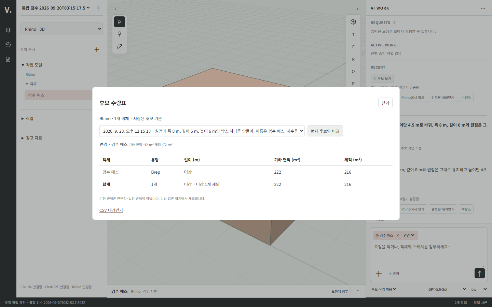
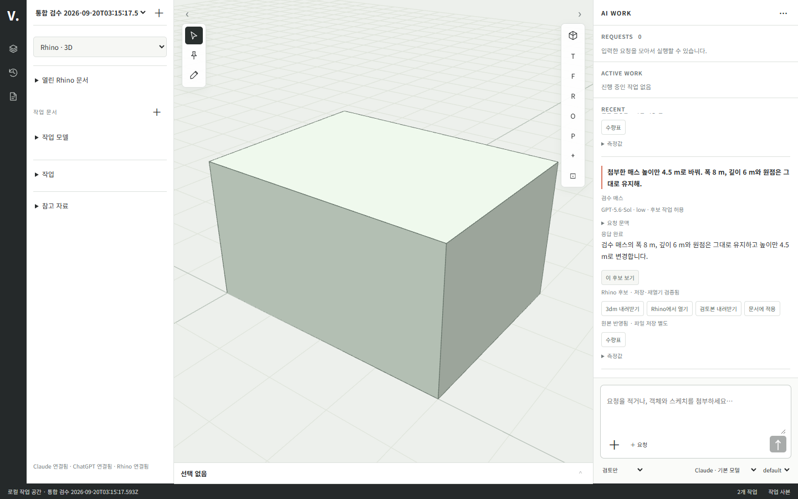

# 실제 작업 공간 통합 검증

## 범위와 구현

사용자가 브라우저 채팅·스케치·클릭을 통한 실제 AI 작업 수행까지 자율 개발을 지시했다. 이전 프런트 승인 대기는 이 범위에서 대체됐다. PRD의 전체 MVP 수용 완료를 의미하지 않는다.

제품 화면은 `src/ui/`, HTTP 연결과 작업 실행은 `src/server/`, 호스트 전송과 문서 처리는 `hosts/rhino/`·`hosts/zwcad/`, 요청 저장과 기하 검증은 `src/core/`다. 이전 `tools/mockups/workspace/`는 합성 검수본이며 실제 실행 URL과 구분한다.

브라우저 → 인증된 로컬 API → SQLite 요청 기록 → 공식 구독 CLI → 검증한 유한 기하 명령 → 설치된 Rhino MCP 로컬 브리지 → 별도 headless 문서 → 3dm 저장·재열기 → 네이티브 메시/선 재조회 → 브라우저의 순서다. AI가 반환한 코드를 실행하지 않는다. 현재 기하 명령은 박스, 폴리라인, 닫힌 XY 경계 돌출, 이동, 생성 기준이 있는 객체의 높이 변경, 후보 내 객체 제거다. 기존 사용자 문서에 이 명령을 직접 적용하지 않는다.

## 실제 관측 결과

환경은 Windows, Rhino 8.34.26223.11001, 공식 Codex CLI의 ChatGPT 구독 로그인, Chrome + Three.js 0.186.0이다. 사용자 작업과 분리한 Rhino 인스턴스에서 mcpstart를 켰다.

| 시험 | 실제 결과 |
|---|---|
| 브라우저 채팅으로 원점에 10×8×6m 박스 요청 | 실제 구독 응답을 해석하고 Rhino 객체 생성·저장·재열기 성공, 브라우저에 네이티브 메시 표시 |
| 뷰포트 객체 클릭 → 대화에 첨부 → 높이만 4.5m | 저장된 입력에 대상 핀 1개, 결과 치수 10×8×4.5m와 원점 유지 |
| XY 평면 세 점 스케치 → 경계 역할 → 3m 돌출 | 스케치 좌표가 실제 닫힌 경계/돌출로 연결됨. 기존 박스 유지, 새 입체와 함께 재조회 성공 |
| 모델·effort 선택 | 두 번째·세 번째 요청에 gpt-5.6-sol / low가 저장되고 실제 CLI 인자로 전달됨 |
| 공급자 전환 | ChatGPT로 생성·수정한 박스의 10×8×4.5m 문맥을 Claude 구독이 이어 받아 읽기 전용 응답. 형상 변경 없음 |
| 3dm 파일 업로드 → 클릭 → 2m 이동 | 실제 파일을 작업 사본으로 가져오고 AI가 X 이동 실행. 원점 [2,0,0], 체적 480m³ 보존 |
| 검토본 내려받기 | PNG 뷰·요청·네이티브 측정값을 포함한 단독 HTML 다운로드 후 다시 열어 이미지 로딩과 체적 480.000 확인 |
| ZWCAD → Rhino 연계 | 브라우저에서 CAD 20×10m 닫힌 LWPolyline(200m²) 생성 후 핀으로 첨부. Rhino 6m Extrusion(체적 1,200m³) 생성·저장·재열기 성공. CAD 경계 유지 |
| 실제 DWG 다운로드 | 브라우저 다운로드 이름 VIDE-candidate.dwg, AC1032 파일 서명, 35,561 bytes 확인 |
| 네이티브 측정 실험 | 10×8×6m 박스의 Rhino 표면적 376m², 체적 480m³ 확인 |

합성 시험 결과와 SQLite/3dm은 무시된 `.vide/integration/`, `.vide/native-check/`에 있다. 이들은 사용자의 논현동 원본이 아니다. 재현 가능한 자동 검사 코드는 `tests/core/geometry.test.mjs`, `tests/server/execution.test.mjs`, `tests/server/requests-http.test.mjs`, `tests/server/rhino-transport.test.mjs`다. 기존 검사를 포함한 `npm.cmd test` 42개가 통과했다. 네트워크·실계정·Rhino 실험을 가짜 어댑터 검사와 합산해 같은 증거로 취급하지 않는다.

## 현재 실행과 한계

`npm.cmd run workspace`는 서버와 기본 브라우저를 함께 열고, `npm.cmd start`는 서버만 실행한다. 콘솔 또는 데이터 폴더의 `launch.json`에 있는 개인 실행 링크를 연다. 데이터 위치는 `VIDE_DATA_DIR`, 기본값은 `%LOCALAPPDATA%/VIDE`다. Claude 실행 경로는 기본 사용자 설치 경로 또는 `VIDE_CLAUDE_PATH`, Codex는 npm 설치 경로 또는 `VIDE_CODEX_PATH`다. 실제 구독 로그인이 필요하다. Rhino는 현재 설치된 rhinomcp 플러그인의 mcpstart가 켜져 있어야 한다.

모델 목록은 Codex의 로컬 모델 캐시와 공급자 기본 모델을 사용한다. 캐시가 계정의 현재 가용성을 보장하지 않으므로 실제 호출 오류는 실패로 표시한다. 공급자 자동 교체나 API 키 비용 경로로의 전환은 하지 않는다.

요청 기록, 중복 ID 보호, 프로젝트별 실행 충돌, 실패/중단/재시작 상태, 현재 후보 기준 핀 검증, 읽기 전용 권한 거절을 구현했다. 초안은 프로젝트별 브라우저 저장소에 보관한다. 텍스트 참고 자료는 50KB 이하 TXT·MD·CSV·JSON만 지원한다. 이 제한은 제품의 최종 첨부 범위 확정이 아니다.

현재 3dm 가져오기는 64MB·유효 객체 500개로 한정한다. 모델 단위를 m로 환산한 별도 사본이며 원본 파일을 바꾸지 않는다. 가져온 객체는 현재 이동·작업 사본 내 제거를 지원하며 임의 솔리드의 높이 변경은 지원한다고 표시하지 않는다. 생성 후보의 돌출은 실제 Extrusion으로 저장하고 표시용 메시만 Brep를 통해 추출한다. 이후 파일 지문이 달라지면 실행을 거절하고 재가져오기를 안내한다.

미완료: 기존 사용자 원본 적용/열린 문서 직접 편집 충돌, 기존 DWG 가져오기·원본 적용, 복수 문서 동시/부분 실패 연계, 고급 보고서·수량표·검토본 비교, 외부 웹, 확장, 설치 배포와 전체 수용 검수. ‘Rhino에서 열기’ UI는 새 인스턴스에 생성 파일을 여는 기능이며 기존 사용자 원본 적용 완료를 뜻하지 않는다. 전체 AC 완료 판정은 PLAN §6.6에 남아 있다.

## 경계별 최종 확인

| 경계 | 확인 |
|---|---|
| UI → API | 실제 브라우저에서 채팅·핀·스케치·모델/effort 입력 저장 |
| API → 구독 AI | ChatGPT 생성/수정 및 Claude 읽기 전용 응답 관측 |
| AI → Rhino | 검증한 명령만 실행, 네이티브 생성/이동/돌출 및 파일 재열기 |
| Rhino → 브라우저 | 실제 메시/선 및 객체 식별자·측정값 반환 |
| 저장 → 복구 | 새로고침 후 작업 4건·후보 3건, 프로젝트별 초안 복구 |
| 전달 | 실제 3dm 다운로드(46,159 bytes), 단독 HTML 검토본 재열기 |
| 브라우저 품질 | 데스크톱/390px 모바일, 정투영 전환, 콘솔/페이지 오류 0건 |

반복 확인용 명령은 `node tests/integration/browser-workspace.mjs <설치된 Playwright 모듈 경로> <launch.json 경로>`다. 이 검사는 이미 저장된 합성 결과를 사용하며 AI를 재호출하거나 호스트를 변경하지 않는다. 증거 화면은 [데스크톱](../assets/native-workspace/desktop.png), [모바일](../assets/native-workspace/mobile.png), [검토본](../assets/native-workspace/report.png)이다.

## ZWCAD 실제 연결

`hosts/zwcad/workspace.ps1`은 COM에서 이번 호출로 만든 문서 참조만 사용한다. 기존 사용자 문서를 활성 문서라는 이유로 수정하지 않고 앱 전체를 종료하지 않는다. 생성한 DWG를 저장·닫기·재열기해 Handle·점열·면적을 읽는다. 현재 호스트 내부는 mm, IDE 입출력은 m이며 좌표와 면적을 명시적으로 환산한다. 쓰기는 어댑터 내부에서 직렬화된다. 로컬 작성 스크립트의 실행 정책은 자식 프로세스에만 RemoteSigned로 지정하고 사용자/컴퓨터 정책을 변경하지 않는다.

UI 작업 호스트를 Rhino/ZWCAD로 고르며 다른 호스트에서 첨부한 핀은 읽기 전용 기하 참조다. 결과 문서 기준으로 사용할 수는 없다. [연계 화면](../assets/native-workspace/cross-host.png)을 실제 Chrome에서 확인했고 페이지 오류는 없었다. 현재 지원은 새 평면 폴리라인 작업 사본이며 일반 CAD 전체 지원이나 원본 동시 적용을 뜻하지 않는다.

## 사용자 UI 스터디 반영 회귀 — 2026-09-20

- 실제 저장된 요청 4건·네이티브 결과 3건으로 새 화면을 확인했다. 이번 회귀에서는 유료 AI 호출이나 호스트 변경을 추가 실행하지 않았다.
- 직교/원근 전환, 후보 전환, 네이티브 3dm 내려받기(46,159 bytes), 객체 속성/형상 탭, 검사기 접기, 스케치 진입/취소, 초안 재로딩을 통과했다.
- 1440×960 데스크톱 및 390×844 모바일에서 화면을 확인했다. 모바일 가로 넘침 없음, 브라우저 콘솔/페이지 오류 0건. 스크린샷은 기존 desktop.png·mobile.png를 현재 화면으로 갱신했다.
- `npm test`: 42건 통과. 기존 실호스트 실행 증거는 앞 절과 구분한다.
- ChatGPT 공유 설계 대화는 HTTP 페이지 응답 안에서 오류를 반환해 본문 미확인. HTML 스터디의 배치·스타일을 반영했으며 예시 데이터·가짜 실행 상태는 사용하지 않았다.

## 요청 묶음·좌표·수량표 회귀

- 2026-09-20 재검증: 자동 테스트 45건 통과. 보호 객체 이동/삭제/치수 변경 거절, 미상 값 집계 제외, CSV 수식 방어를 포함한다.
- 브라우저에서 두 요청 항목의 새로고침 복구·결합 본문, 의도적인 503 응답 후 초안 보존을 확인했다. 콘솔의 503 한 건은 이 실패 주입의 예상 결과이며 그 외 오류는 없었다. 실제 AI 호출은 추가하지 않았다.
- 자유 직교/원근 전환, 선택 프레이밍, 검사기 키보드 높이 조절, 숫자 좌표 추가·수정, 기존 실결과 수량표 API 조회와 CSV 다운로드를 통과했다.
- CSV 외부 스프레드시트 앱 열람, 수량표 필터 영속화, 전체 MVP 완료는 이번 검증에 포함하지 않는다.

## 후보 비교 회귀

자동 테스트 47건 통과. 비교 단위 검사에서 추가/삭제/형상 변경·체적 차이, 연결되지 않은 동일 이름/ID와 호스트 불일치의 비교 불가를 확인했다. 인증된 HTTP 검사에서 연결된 두 후보의 변경/체적 +4, 다른 프로젝트의 비교/수량 접근 거절을 확인했다. 브라우저에서는 기준 ID가 없는 기존 실험 결과를 비교 불가로 표시하는 것을 확인했다. 과거 기록을 임의로 보정하지 않았다.

## 실제 구독 AI → Rhino → 수량 비교 재검증

별도 통합 검수 프로젝트에서 ChatGPT 구독 CLI(Sol, low)로 8×6×6 m 매스를 생성하고, 클릭한 객체를 핀으로 첨부해 높이만 4.5 m로 바꿨다. 두 요청 모두 Rhino 네이티브 생성·저장·재열기를 통과했다. 폭 8 m·깊이 6 m·원점 유지, 실제 체적 288 → 216 m³(차이 −72 m³), 기하 면적 차이 −42 m²를 비교 API와 브라우저 수량표에서 확인했다.

재현 코드: `tests/integration/native-workflow.mjs`. 실제 CLI 사용과 격리된 네이티브 파일 생성은 `--run-live`를 명시해야 실행된다. 이번 실행 중 테스트 대기 로직 두 곳을 바로잡았으며, 이미 성공한 요청은 재호출하지 않고 동일 검수 프로젝트를 읽어 재개했다. AI 호출은 총 2회다. 사용자 원본 문서에 적용한 검수가 아니다.

## 호스트 불명확 결과 보호

자동 테스트 49건 통과. 호스트 단계에서 재시작한 작업은 객체 의도를 보존한 `unknown`, AI 단계 중단은 `interrupted`로 구분했다. 불명확 작업이 있는 동일 호스트의 새 후보 제출은 차단하고 읽기 검토는 허용했다. 전송 응답 유실 시험에서도 의도 객체와 미확인 상태를 유지했다. 실제 호스트 강제 종료나 사용자 원본 복구 시험으로 확대하지 않는다.

## 경계 수정·복사 검수

자동 테스트 50건 통과. `tests/integration/native-geometry.mjs --run-live`에서 격리된 Rhino 시험 파일을 생성했다. 삼각 경계의 폭 4→5 m 정점 수정 후 높이 6 m 유지, +10 m 이동 복사, 네이티브 Extrusion 2개, 체적 각각 약 45 m³, 저장·재열기 검증을 통과했다. 이 시험은 AI 없이 검증된 기하 명령을 실제 호스트에 전달한 것이며 임의 네이티브 객체 복사나 원본 적용 완료를 뜻하지 않는다.

## 열린 Rhino 문서 조회

실행 중인 검수 Rhino의 열린 문서 ID·Millimeters 단위·객체 0개를 읽고, 브라우저에서 지정 문서의 선택 0개 조회를 확인했다. 거짓 프로세스 인스턴스는 STALE_CONNECTION, 음수 문서 ID는 INVALID_INPUT으로 거절했다. 문서 열기/닫기·선택 변경·원본 쓰기는 수행하지 않았다. 객체가 있는 사용자 원본의 전체 취득·원본 적용은 별도 후속 검증이다.

## 생성 후보의 실제 Rhino 문서 적용

자동 테스트 52건 통과. 서버 검토 없는 적용 거절, 승인한 명령의 단일 실행·중복 응답, 다른 프로젝트 접근 거절과 불명확 후속 쓰기 차단을 검사했다.

`tests/integration/native-application.mjs`는 명시한 검수 Rhino 프로세스/빈 문서만 대상으로 한다. 이번 실제 브라우저 실행에서 무관한 시험 점을 둔 뒤 첫 매스 후보 적용, 두 번째 높이 수정 후보 적용을 수행했다. 매스 GUID 유지, 높이 6,000→4,500 mm, 전체 객체 2개(매스+무관한 점) 유지, 새로고침 후 적용 이력 2건을 확인했다. 원본 파일 저장은 하지 않았다. 추가 어댑터 확인에서 적용 후 실제 객체 수·경계 재조회도 통과했다. 잘못된 원본 지문은 쓰기 전에 SOURCE_CHANGED로 거절했다.

이 검수는 에이전트가 만든 검수 Rhino 문서만 변경했다. 사용자의 기존 논현동 프로젝트를 적용 대상으로 사용하지 않았다. 임의 가져오기 객체·ZWCAD 적용·전체 MVP 완료로 확대하지 않는다.

## 열린 Rhino 문서 취득 검증

근거: SPEC-01.2·9, SCR-01, T-003·005. `tests/integration/native-capture.mjs`는 명시한 합성 Rhino 문서를 읽어 새 검수 프로젝트의 작업 사본으로 취득한다. 이 검수에서 2개 객체, 솔리드 체적 216 m³, 객체 목록과 브라우저 재열기 복원을 확인했다. 취득 전후 원본의 형상·속성 지문·단위·경로·이름·modified·선택을 비교해 불변을 확인했다. 원본 저장/변경과 AI 호출은 수행하지 않는다.

프로젝트 `34731109-a5c8-4b88-b5c5-17fada81fac2`, 취득 `5b659069-0e8e-4a4e-ad31-02b067da1704`. 단위/계약 테스트 54개가 통과했다. 취득 요청 멱등성·다른 문서로 요청 ID 재사용 거절·실패 시 이전 기준 보존을 검사했다. 브라우저에 표시되지 않는 Point 1개는 객체 목록/파일에 남으며 미지원 개수를 표시한다. 일반 레이어·블록·참조 문서와 수동 Sync 전체 지원을 선언하지 않는다.

## 호스트 선택을 통한 원본 사본 편집

`tests/integration/native-source-edit.mjs`에서 기존 합성 취득 프로젝트의 실제 Rhino 솔리드를 선택하고 브라우저 ‘선택을 요청에 첨부’를 사용했다. 두 번 눌러도 핀은 1개다. Sol low 구독 호출 1회로 X 방향 +2 m 후보를 생성했다. 체적 216 m³, 무관한 Point 위치, 열린 원본 문서 지문을 유지했으며 시험용 선택은 종료 시 복원했다. 후속 요청 ID는 `171bd7e0-2d30-4767-b168-50ad306a2a2c`다. 문서 취득 기준은 직전 절과 같다.

단위/계약 테스트 56개 통과. 추가 검증은 다른 문서·다른 프로세스·변경된 원본·미대응 객체 선택에서 핀이 부분 추가되지 않는지와 기존 역할/본문 보존이다. 실제 원본 쓰기와 호스트 기본 도구 재편집의 일반 지원을 대신하지 않는다.

## 취득 원본 이동 적용의 실제 검증

`tests/integration/native-original-apply.mjs`는 앞선 실제 구독 이동 결과를 영향 검토한 뒤 같은 원본 문서에 적용한다. 수정 1개/추가·삭제 0개, 2,000 mm 이동, 원래 GUID·검사 대상 속성·무관한 객체 보존, 기록 재열기와 오래된 후보 재적용 거절을 확인했다. 저장은 별도로 남는다. 프로젝트 `bd126b57-3fae-4a8b-9cc6-96f3c40be3d0`, 취득 `d93590d6-babe-4a74-986e-b4a317d50f9a`, 이동 후보 `a4d2be65-a84a-4f4e-9475-e6d61e06eb3b`. 전체 단위/계약 테스트는 59개 통과했다.

첫 시험 프로젝트의 명령 `e0505422-81b4-4c40-980d-d3b1f31931e8`은 실제 이동 후 속성 아카이브 비교 실패로 unknown을 보존한다. 원본을 자동 재실행하지 않았다. headless 사본에서 아카이브의 차이와 공개 속성 동일성을 재현하고, 실제 속성 스냅샷 비교로 교체했다. 이름·사용자 문자열의 실제 변경은 이 비교가 검출함을 확인했다. 최초 문서는 별도 로컬 검수 파일로 저장해 남겼다. 수정본의 성공은 새 합성 문서에서 확인했으며, 과거 unknown을 성공으로 소급 변경하지 않았다.

## 응답 유실·재시작 뒤 원본 이동 복구

`tests/integration/native-recovery.mjs`는 격리된 테스트 서버/DB에서 고정 AI 응답 어댑터와 실제 Rhino를 사용한다. 원본 이동은 실제 수행하고 응답만 unknown으로 바꿔 유실을 주입한다. 서버를 다시 연 뒤 브라우저 ‘결과 다시 확인’으로 실제 적용을 확인했다. 시험 중 증거 파일 손상과 단위 변경은 각각 해소 거절을 확인하고 시험 직전 상태로 복원했다. 재조회로 호스트 쓰기를 추가 실행하지 않았다.

최종 검수 프로젝트 `a61826c0-53ee-4ccd-9317-617a3639e878`, 명령 `7ce90ef4-de28-4dee-93b7-f461000d79f0`. 데이터는 `.vide/recovery-check`의 독립 DB/후보/증거에 보존한다. 실제 쓰기 1회, 재시작 복원·브라우저 표시·증거 손상 거절·다른 단위 거절이 통과했다. 이 시험은 실제 AI 호출을 주장하지 않으며 앞선 구독 CLI 검증과 구분한다. 단위/계약 테스트 60개 통과.

## 필터·그룹·표 구성 저장 검증

`tests/integration/browser-table-views.mjs`에서 실제 Rhino 취득 결과 2개 중 Brep 1개를 필터하고 레이어 합계를 저장했다. 브라우저 재열기 후 구성을 적용하고, CSV가 같은 후보 ID·레이어·필터 대상·그룹 합계를 포함하며 제외한 Point를 포함하지 않는지 확인했다. 결과 0개도 마지막 성공 행을 남기는 실패와 구분했다. 프로젝트 `44961bf1-0bb1-4c89-8b09-f43b111dae00`, 취득 `43a6bc33-4430-4b17-90e0-ae1668a3b6d2`, 구성 `5d455cab-b3b2-4bcd-b659-02accfa920eb`. 화면은 [수량표 구성](../assets/native-workspace/quantity-filters.png)에 보존했다.

단위/계약 테스트 63개 통과. DB 재열기, 다른 프로젝트 접근, 오래된 갱신·삭제 거절, 새 객체가 포함된 다음 기준의 재계산, 미상 처리와 CSV 그룹 합계를 검사했다. 실제 Rhino의 3-4-5 선분은 5 m, 반지름 2 m 원의 네이티브 길이는 12.566370643255096 m로 공식 기본 상대 정밀도 범위에 들었고 지정 레이어 Site를 읽었다. 법정 면적이나 과거 자료의 누락 측정값을 추정하지 않는다.

## 고정 검토본 저장·재열기

`tests/integration/browser-reviews.mjs`에서 실제 취득 후보와 저장한 레이어별 표 구성을 검토본으로 저장했다. 왼쪽 목록에서 재열기, sandbox iframe 렌더, 자체 포함 PNG/HTML 다운로드, 필터된 표, 원본 반영 기록 표시를 검증했다. [저장한 검토본](../assets/native-workspace/saved-review.png)을 실제 Chromium 1440×900에서 확인했다. 원본 호스트 쓰기·AI 호출은 없다.

단위/계약 테스트 64개 통과. 원래 요청의 본문·체적·적용 상태를 바꾼 뒤에도 검토본이 당시 값을 보존하고, 다른 프로젝트 접근을 거절하며, 원본 경로·첨부 전문을 payload에 넣지 않는지 검사했다. HTML 특수문자는 이스케이프한다. 검수 프로젝트는 직전 수량표 검수 프로젝트를 사용했다. 저장된 검토본은 3D 이미지와 표의 고정 열람이며 대화형 전체 모델 복원·외부 웹 게시 완료를 뜻하지 않는다.

## 저장한 검토본 A/B 브라우저 검증
기존 실제 AI·Rhino 검수 프로젝트 a6e12909-6461-47bc-8cae-ca0910a27e7f의 두 후보를 UI에서 각각 저장하고 비교했다. 신규 AI 호출·원본 쓰기는 없다. 8×6×6 m → 8×6×4.5 m에 대해 체적 −72 m³, 기하 면적 −42 m²가 표시됐다. 두 sandbox iframe과 390px 화면 내 대화상자 폭, 브라우저 예외 없음, 자동 테스트 66개 통과를 확인했다. 재현: tests/integration/browser-review-comparison.mjs. 증거: [A/B 화면](../assets/native-workspace/review-comparison.png).
비교는 저장한 표시 형상/속성 기준이다. 네이티브 원본의 모든 기하·속성 동일성이나 외부 공유 검수는 이 시험이 보증하지 않는다.

## 검토 의견 보존·요청 첨부 검증
tests/integration/browser-review-notes.mjs에서 저장은 성공했으나 응답만 유실되는 상황을 주입했다. 동일 ID 재확인 후 의견은 하나이며 원 기준이 보존됐다. 다른 후보에서 첨부 거절, 원 기준 열기 후 기존 초안에 의견/핀/출처 첨부, 새로고침 후 기준 후보 유지까지 확인했다. 신규 AI·호스트 쓰기는 없다. [의견을 첨부한 초안](../assets/native-workspace/review-note-draft.png).
자동 시험 67개와 기존 browser-workspace의 카메라·스케치·초안·다운로드 회귀 시험이 통과했다. 외부 의견 서버·PC 종료 지속성·펜 입력은 미검증이다.

## 네이티브 복사 후보 검증
tests/integration/native-copy.mjs는 독립된 시험 3DM에서 이동→복사→재복사→원 객체 삭제→후속 이동/복사를 검증했다. 원 기준 파일 해시·사용자 문자열 유지, Extrusion 체적 72 m³, 최종 X=13/17/20 m, 저장/재열기를 확인했다. 그룹 속성이 있는 원본의 복사는 HOST_REJECTED로 실패하며 성공 파일로 보고하지 않았다.
tests/integration/browser-native-copy.mjs는 3DM 가져오기→핀→구독 Sol low 1회→후보 표시까지 검증했다. 프로젝트 a7f862d5-cc07-4dd9-8a12-b6eea516afca, 요청 122035ba-386d-415a-b45e-510d87f61a3f. 두 Extrusion의 체적은 각각 72 m³, X는 0/10 m다. [복사 화면](../assets/native-workspace/native-copy.png). 전체 자동 시험 68개 통과. 다른 네이티브 유형·일반 사용자 플러그인 데이터·복사 후보 원본 적용은 이 실증이 보증하지 않는다.

## 점 객체 표시·선택 검증
tests/integration/browser-point-selection.mjs에서 [10000,20000,30] m의 점을 실제 WebGL로 렌더했다. 정투영/원근 중앙 클릭, 핀 첨부 콜백, 점에서 30px 떨어진 클릭 미선택, 단일 점 전체 보기를 확인했다. 이 시험은 표시·선택 계약이며 새 호스트 작업이나 AI 호출을 수행하지 않았다.

## 실제 치수와 Inspector 검증
반지름 2 m의 네이티브 원을 새 작업 사본으로 읽어 boundsSize=[4,4,0] m, 길이 12.566370643255096 m, Site 레이어와 Inspector 표시를 확인했다. 프로젝트 6b621c71-4030-426e-b250-c94c56a9d617. [Inspector 화면](../assets/native-workspace/native-measurements.png). tests/integration/browser-native-measurements.mjs와 native-geometry.mjs의 [5,3,6] m 돌출 범위 검증을 통과했다.
실행 계약 시험은 AI 문맥에 길이·실제 범위·한글 레이어가 전달되고 표시 점열은 포함되지 않는지 확인한다. 전체 자동 시험 69개 통과. 축 정렬 경계 상자의 범위는 부재 고유 파라미터나 법정 치수가 아니다.

## DWG 입력 계약과 실환경 차단
70개 자동 시험 중 DWG 업로드 분기는 올바른 호스트 선택·시그니처 검사·업로드 임시 파일 제거·참고 상태를 확인했다. PowerShell 구문 검사를 통과했다. tests/integration/native-dwg-import.mjs는 선행 합성 DWG 생성이 90초 동안 응답하지 않아 HOST_RESULT_UNKNOWN으로 종료됐다. import 자체의 실환경 성공 증거는 아직 없다. 생성 대상은 PLAN의 고유 .vide 시험 경로이며 사용자 문서를 닫거나 새 생성 요청으로 우회하지 않았다.

## AI 설정 화면 검증
tests/integration/browser-ai-settings.mjs에서 실제 Codex 실행 경로를 설정/재열기하고 없는 파일 입력을 거절한 뒤 기존 설정이 보존됨을 확인했다. 검증 후 원 설정으로 복원했다. Claude Code·Codex 모두 available=true의 공식 구독 상태를 반환했다. [설정 화면](../assets/native-workspace/ai-settings.png).
자동 시험은 경로/버전 충돌·셸 문자열/토큰 거절·진행 중 요청의 기존 경로 유지와 다음 요청의 변경 경로 사용을 확인한다. 72개 자동 시험 통과. 이 시험에는 AI 생성 호출이나 원본 호스트 쓰기가 없다.

## 신뢰 확장 전체 흐름 검증
tests/integration/browser-extensions.mjs에서 등록/활성화→실제 저장된 Extrusion 2개 요약→작업 이력→원 객체 선택→비활성화를 확인했다. 프로젝트 a7f862d5-cc07-4dd9-8a12-b6eea516afca, 실행 bfaf6d24-2f87-41f6-baa1-c8c5d0a41d23. 비활성화 후 새 실행과 일반 AI API 우회가 거절되고 동일 실행 ID는 기존 결과를 반환한다. [확장 결과](../assets/native-workspace/extension-summary.png).
계약 시험은 권한 밖 선언·다른 프로젝트·알 수 없는 확장·중복 요청 거절, 잘못된 원 데이터의 실행 실패 기록과 이전 결과 보존을 확인했다. 자동 시험 73개와 브라우저 작업 공간 회귀 통과. 외부 개발자 확장 배포·범용 샌드박스·장기 작업 중단은 미구현이다.

## 실행 재사용·종료·재시작 검증
tests/server/lifecycle.test.mjs는 실제 Node 프로세스를 실행해 프로젝트를 저장하고 두 번째 실행이 기존 제어자를 재사용한 뒤 종료되는지 확인했다. 앱 종료 API→프로세스 종료→다시 실행 후 같은 프로젝트가 남아 있다. 잘못된 외부 launch URL을 거절했다. 종료 요청 이후 조회는 유지하고 새 쓰기는 APP_STOPPING으로 거절하는 시험도 통과했다. 총 75개 자동 시험 통과.
이 시험은 현재 Windows 환경의 실제 프로세스 수명/데이터 유지 검수이며 개발 도구가 없는 별도 PC 설치 검수를 대체하지 않는다.

## Windows 실행 패키지 검증
T-011 / SPEC-05.3·6 / AC-23·27의 일부 검증이다. src/desktop/build.mjs의 전체 생성이 성공했고 tests/integration/portable-package.mjs가 0.1.0-dev.20260920.1 ZIP의 67개 파일 해시와 포함 Node 실행을 확인했다. PATH를 System32로 제한하고 명시 CLI 환경 경로를 제거한 상태에서 WebGL 화면·ChatGPT 연결·프로젝트 생성·중복 실행 재사용·UI 종료·다시 실행·같은 프로젝트 복원·실행 폴더 제거 후 SQLite 보존을 확인했다.
격리 실행에서는 공식 로그인 상태를 확인할 수 없어 연결 단언이 실패했다. 사용자 프로필 접근을 허용한 검증 실행에서 통과했다. AI 생성 호출이나 사용자 CAD 원본 쓰기는 없었다. 시험 데이터는 .vide/package-check/2f411d87-84c2-44af-bc59-ca2c82ca8bcf/data이며 설치 폴더는 검증 후 제거됐다. 전체 자동 시험 75개 통과. 별도 비개발 PC·서명/설치 프로그램·DB 마이그레이션 검수를 대체하지 않는다.

## 호환되지 않는 데이터 보존 검증
T-011 / SPEC-05.6: tests/core/database-check.test.mjs는 미래 버전 99, 복수 버전 행, 다른 앱 DB, SQLite가 아닌 파일의 시작 거절과 바이트 보존을 확인한다. 같은 파일을 두 번 시도해 실패한 시작이 제어 잠금을 남기지 않음을 확인했다. 정상 파일 재시작 회귀를 포함한 자동 시험 76개 통과. quick_check는 구조 검사이며 모든 업무 의미의 무결성이나 복구 성공을 보증하지 않는다.

## 오프라인 백업 검증
T-011 / SPEC-05.3·6: tests/core/backup.test.mjs에서 실행 중 제어 잠금 거절, 기존 백업/중첩 목적지 거절, 원 DB 바이트 보존, 백업 DB의 프로젝트 읽기, 모델 파일 해시와 변조 탐지, launch 토큰 제외를 확인했다. 전체 자동 시험 77개 통과.
0.1.0-dev.20260920.2 패키지의 70개 파일을 검증하고 포함 런타임으로 백업 create/verify까지 실행했다. 브라우저·실제 구독 연결·중복 실행·재시작·제거 후 자료 보존 회귀도 통과했다. 시험 데이터 .vide/package-check/10718fdf-5a9a-4a65-94d6-f365345c1e58/data. 실제 사용자 데이터 복원, 다른 PC/경로 이관, DB 버전 변경은 시험하지 않았다.

## 프로젝트별 초안·메뉴 회귀
T-002·010 / SPEC-01 / SCR-01·07: tests/integration/browser-draft-isolation.mjs에서 두 기존 프로젝트의 독립 저장·불러오기, 다른 프로젝트 ID 변조 거절과 현재 입력 보존, 과거 후보 기준 복원, 기준 없는 초안의 재열기 보존을 확인했다. AI/호스트 요청은 제출하지 않았다. 1440×900·390×844에서 메뉴가 화면 안에 있고 summary로 닫힘을 확인했다. [드롭다운 화면](../assets/native-workspace/draft-menu.png). 기존 공용 저장본은 자동 이관하지 않는다.

## 중단 요청 초안 복원 검증 — 2026-09-21
T-002·004 / SPEC-01·05.5 / SCR-03·07: tests/core/request-draft.test.mjs는 이전 후보/모델/권한 보존, 원 입력과 가변 참조 분리, 요청 ID 제외, unknown·누락 기준 거절을 확인한다. tests/integration/browser-request-restore.mjs는 응답 fixture로 복원 취소/수락, 핀·자료·본문·기준 복원, 사용 불가 모델의 전송 차단과 새로고침 보존을 검증했다. 요청 POST는 0건이며 실제 AI/호스트 기록을 변경하지 않았다. 자동 시험 78개 통과.
