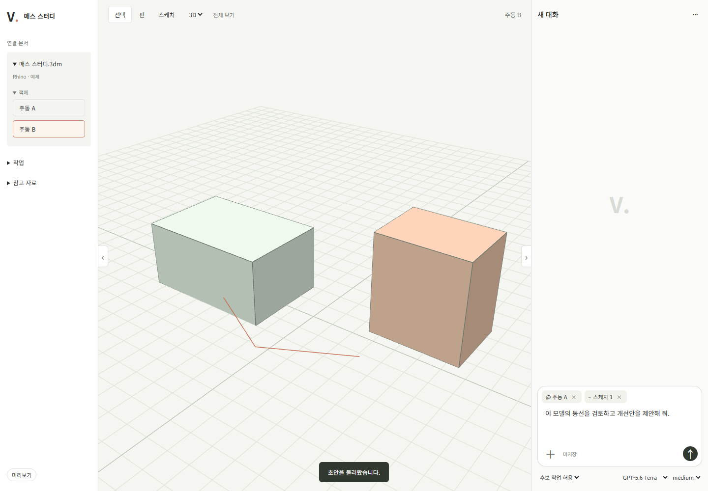
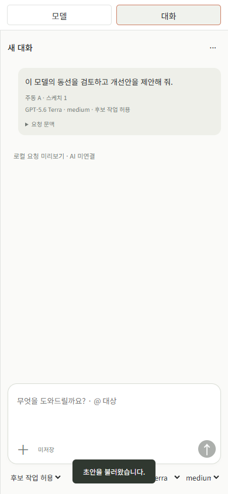

# 계획 보완과 첫 공간 작업 프런트 검수

## 1. 위임과 착수 범위

사용자의 “지금 사항들 보완해서 계획 문서 보완하고, 충분하다는 생각이 들면 이제 개발 단계로 착수” 지시에 따라 앞선 여섯 지적을 보완하고 T-014·016의 합성 프런트에 착수했다. PRD 범위는 변경하지 않았다. 사용자 브라우저 승인 미수신이며 DB/API·AI·호스트 통합은 진행하지 않았다. 기존 src/tests와 훅은 이번 작업에서 수정하지 않았다.

| 지적 | 반영 위치·결론 |
|---|---|
| 백엔드 선행·승인 누락 | PLAN §6.1·3·5, 가이드 §12에 프런트→사용자 승인→통합 관문과 승인 기록 필드 |
| AI.md 권한·열린 검토 | §8 착수 조건, §11 권한 확대 제한, 부록 항목별 위임·처리 기록. 과거 승인 소급 주장 없음 |
| 치수·평면·선 역할 | SPEC-01.5.1~3의 입력 의미·단위·출처·충돌·선택·역할; PLAN §4.1 물리 계약 |
| 상태별 행동 | SPEC-00.9.1의 조건 결합·우선순위·행동표, Design의 정본 참조 |
| UI 기술·보안 | ESM/CSS 유지 결정, 현재 CSP·Origin·정적 배포 검증. React 비교 실험은 미수행 |
| AI 연결 두 경로 | ADR-013의 단발 호출 반복을 첫 통합 기준으로 확정. 세션 재사용/app-server는 후속 후보 |

## 2. 실행과 이전 화면 검수 순서 (버전 1~2)

코드: `tools/mockups/workspace/`. 실행: `node tools/mockups/workspace/serve.mjs`. URL: `http://127.0.0.1:4317`.

1. 주동 A 선택 → 선택한 객체 추가 → 변경 의도와 높이 4.5 m 입력 → 후보 만들기.
2. 원본/후보/겹쳐 보기로 6 m와 4.5 m 비교. 높이를 4500 mm로 바꿔 다시 요청한다.
3. B를 선택해도 요청 핀이 A로 유지되는지 확인한다. 핀 버튼을 누를 때만 대상을 바꾼다.
4. 선 입력에서 평면·오프셋 확인 → 역할 선택 → u/v 두 점 입력. 검수 저장 후 저장본 열기로 입력을 확인한다.
5. 패널 버튼/Alt+Shift+L·R로 접고 복귀한다. 좁은 화면은 모델/입력/작업으로 전환한다.
6. 후보 적용·재적용 차단, 높이 수정 뒤 재비교, 오류 검수의 불명확·저장 실패 상태를 확인한다.

이 절은 이전 버전 2 기록이다. 현재 버전 4의 동작과 검증은 §6을 따른다. 브라우저 저장은 `vide:review:workspace:v1` 키만 사용하며 제품 데이터베이스와 다르다. 화면에서 적용해도 실제 문서나 파일을 변경하지 않는다.

## 3. 실행한 검증

| 검사 | 결과·범위 |
|---|---|
| Node 모델 시험 | 5개 통과: 누락/단위 동등성/문장 충돌, 평면·역할, 후보 적용 제한, 중단/재개, 입력 수정으로 불명확 상태 해제 금지 |
| Chrome 브라우저 | 후보 생성, 적용·재적용 차단, 단위 변경의 후보 무효화, 검수 저장/복원, 패널 입력 보존, 평면·점 입력, 불명확 쓰기 차단, 저장 실패 표시 통과 |
| 좁은 폭 | 390×844에서 가로 넘침 없음, 모델/입력/작업 전환과 초안 유지 통과 |
| CSP·정적 서버 | 브라우저 콘솔/CSP 오류 없음. 외부 Origin 403, 제품 API 경로 404. 기존 제품 서버와 같은 CSP 사용 |
| 문서 생성 | MD→HTML 재생성과 일치 검사 수행. git diff --check 통과 |

재현: `node --test tools/mockups/workspace/model.test.mjs`. 브라우저 검사는 `browser-check.mjs`에 설치된 Playwright의 `index.mjs` 경로를 인수로 전달한다. 이번에는 로컬 Codex 런타임의 기존 라이브러리와 설치된 Chrome을 사용했고 새 제품 의존성을 추가하지 않았다.

## 4. 미완료와 다음 행동

이 화면은 첫 높이 변경 흐름의 구현이며 전체 프런트 또는 AC 통과 판정이 아니다. 형상은 합성 객체 두 개의 SVG 투영이며 실제 3D 선택/카메라/면 취득·자유곡선·직접 선 그리기·좌표 점 수정 UI·호스트 동기화는 미구현이다. 좌표 선은 저장하지만 후보 형상 해석에는 사용하지 않는다. 평면 변경은 기존 점이 있으면 차단하고 명시적으로 선을 비운 뒤 새 입력을 받는다. 자유 문장 해석, 유지 핀, 복수 문서, 프로젝트 전환, 공유·표·설정 화면과 실제 연결은 아직 없다. 임의 수치나 AI 성공으로 보충하지 않았다.

첫 프런트 착수에는 충분한 계약이 확보됐지만 전체 MVP 구현 완료까지의 모든 세부 결정이 끝났다는 뜻은 아니다. 사용자 피드백으로 이 흐름을 다듬고 승인 범위를 기록한 뒤 해당 통합을 진행한다. 브라우저 승인 전 준비된 독립 작업은 프런트 개선·검증뿐이며 백엔드로 우회하지 않는다. 설치 호스트·구독 CLI의 실제 지원·이용·배포 조건은 기존 티켓의 실증이 남아 있다.

**사용자 브라우저 승인:** 미수신. **허용된 다음 통합 범위:** 없음.

## 5. 검수 버전 2 — 정보 밀도 조정

사용자의 텍스트·정보 축소 요청에 따라 상단을 한 줄로 통합하고 단계 안내·대형 제목·영문 소제목·반복 설명·상시 하단 안내를 제거했다. 빈 작업 결과는 숨기고 필요한 오류만 입력 가까이에 표시한다. 미리보기 제한은 상단 상세, 일시적인 결과 알림은 잠시 표시하는 메시지로 제공한다. 기능 계약은 유지했다. Chrome에서 후보·저장/복원·패널·평면 입력·상태 차단과 모바일 탭/가로 넘침을 재검증했고 콘솔/CSP 오류는 없었다. 위 스크린샷은 이번 화면으로 갱신했다. 실제 연결 승인은 여전히 미수신이다.

## 6. 검수 버전 4 — 범용 입력과 실제 3D 뷰포트

앞선 높이 전용 화면과 SVG 투영을 대체했다. 우측 하단 대화 작성기, 참조 칩, 모델/effort/permission, 중앙 3D 선택/핀/평면 선 도구를 구현했다. 고정 높이 필드는 제거했다. 모델 목록은 Vino mock을 참고한 예시이며 실제 계정 능력 조회가 아니다. 파일 첨부는 메타데이터만 저장한다. 임의 AI 응답/기하 결과 없이 제출한 문맥과 설정을 로컬 카드로 확인한다. 기존 높이 후보·적용 시연은 현재 화면에 없으며 실제 기능을 제거한 것이 아니라 잘못된 목업 범위를 바로잡은 것이다.

Node 시험 5개 통과: 범용 입력, 선택과 핀 분리, 모델/effort 호환, 평면/원본점/요청 복사, 빈 요청·권한 오류. 설치 Chrome에서 실제 WebGL 렌더링과 드래그 회전/휠 확대의 이미지 변화, 핀 보존, 모델/effort 전환, permission 기록, 평면 점 작성·스케치 첨부, 초안 저장/복원, 패널 복귀, 전송, 390px 모바일을 검증했다. JS/CSP 오류 없음. 헤드리스 검증은 SwiftShader를 허용했으며 실기기 GPU·펜·멀티터치 지원 완료를 뜻하지 않는다. 위 desktop/mobile 증거 이미지는 이번 버전으로 갱신했다. 사용자 브라우저 승인과 실제 AI/호스트 연결은 여전히 미수신/미구현이다.

현재 검수 순서: 3D에서 드래그 회전·휠 확대 → 핀 도구로 객체 클릭 → 스케치 도구에서 평면 선택·점 작성·입력에 첨부 → 일반 문장 입력 → 모델/effort/permission 선택 → 전송해 문맥 카드 확인. 기본 선택 도구에서는 클릭은 선택, 드래그는 카메라 회전, 우클릭 드래그는 이동이다.

## 7. 검수 버전 5 — 탐색·패널 경계·정투영

사용자 지적에 따라 전체 폭 상단 바 제거, 프로젝트/연결 문서·실제 요청·첨부 자료를 좌측으로 정리, 객체 목록은 문서 내부 접기, 패널 토글은 뷰포트 경계로 이동했다. 앞/위/옆은 실제 OrthographicCamera이며 3D만 PerspectiveCamera다. 정투영에서는 회전 대신 평행 이동과 확대를 사용한다. 논현동 model.html의 별도 카메라·뷰 범위 프레이밍·종횡비 유지 원리를 읽고 전체 보기와 리사이즈에 반영했다.

기존 Chrome 검증에 앞/위/옆 각각 실제 정투영 인스턴스 여부, 3D 복귀 시 원근 여부, 전체 보기 실행을 추가했고 통과했다. 카메라 전환·패널 접기 후 스케치/초안 보존·모바일·JS/CSP 오류 검증도 통과했다. 초기에 전체 보기 방향 벡터 계산 문제가 있어 수정한 뒤 재검증했다. 증거 desktop/mobile 이미지를 갱신했다. 실호스트 데이터 연결과 사용자 승인 상태는 변경하지 않았다.
